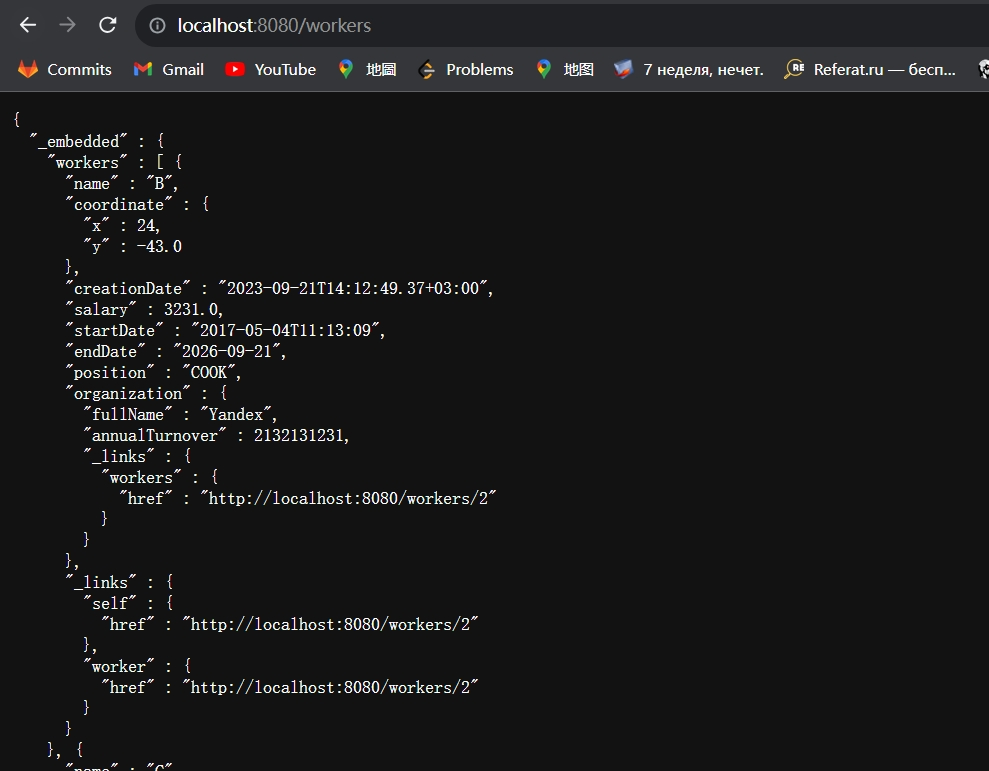
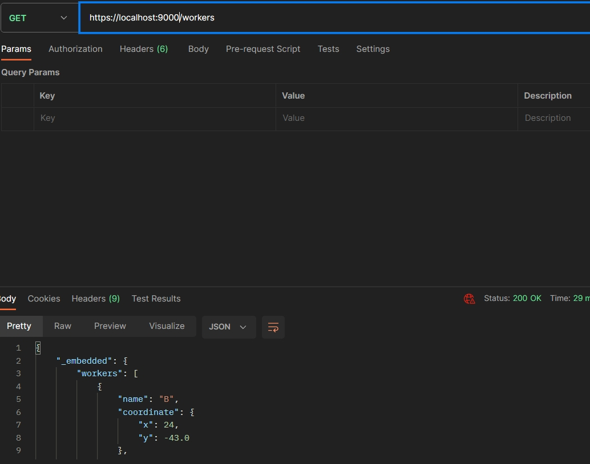
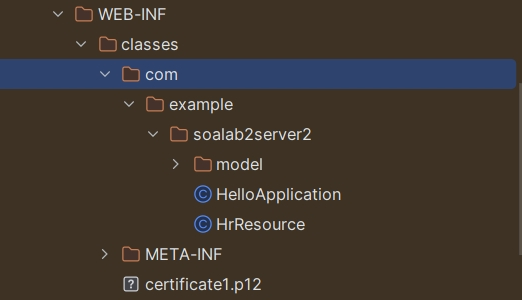
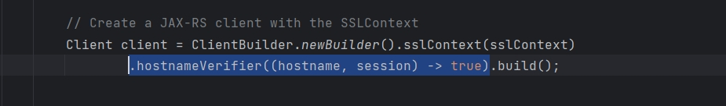
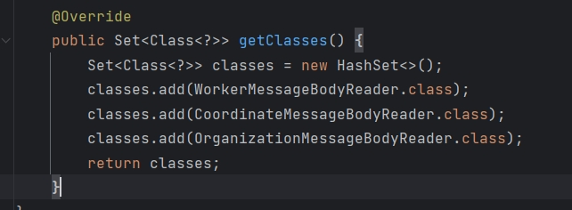

After add certificate to ban http and not safe access, we can get worker api easily by localhost://port/workers. So Here just show what it would be before add security permit to https.

But it's ok to get info with https in postman(don't know why i can do it).

24.09

Problem with ssl sign.

I used openssl to create certification. Configuration like:

server.port=9000
server.ssl.key-store=classpath:certificate1.p12
server.ssl.key-store-password=123456
server.ssl.key-store-type=PKCS12
server.ssl.key-alias=alias

Now we can access operation only by "https://localhost:9000/company/workers/2"."http://localhost:9000/company/workers/2" will returns bad request because it's not safe.

Now problem is that. I have test that without ssl i can normally call any api on spring in JAX-RS(2-nd server). But with ssl i can't call it. I created keystore to access spring api but always get this error:

"javax.net.ssl.SSLException: Unexpected error: java.security.InvalidAlgorithmParameterException: the trustAnchors parameter must be non-empty"

Basically backend left the problem: Доступ к обоим сервисам должен быть реализован с по протоколу https с самоподписанным сертификатом сервера. Доступ к сервисам посредством http без шифрования должен быть запрещён.

On JAX-RS side didn't finish it.

#### script to create .p12 sign

  openssl genrsa -out private.key 2048

  openssl req -new -key private.key -out certificate.csr

  openssl x509 -req -in certificate.csr -signkey private.key -out certificate.crt

openssl pkcs12 -export -in certificate.crt -inkey private.key -out certificate.p12 -name your_alias

### 06.10

At first the reasons that we couldn't fix problem are that:

1. We didn't put the right certificate. We should use .p12 but we put keystore
2. We didn't put the right path to certificate in programm.
3. We didn't set CN in certificate

To solve the problems:

1. put the right .p12. Just copy it from spring server

2. Check what we will get after compiling

   

​	just set path like

​	Of cause absolute path might be better but i don't want to think about it

3. Ignore the CN check

   

   A bad solution. We can also redone the production of certification to set right CN and then use it. But i don't want to do it//

   This is not safe. In job or some formal situation don't ignore it!!!!!!!!

   Final problem. How to do serialization of worker in response of company/move/. Should be like this. Create providers and then register them. But i fails. With this we can't even get response from spring. Without it all right. 

Fire - done

Move - doing

### 06.10

So the problem with xml is that i used realization of jax-rd in jakarta and java ee at the same time. I tried only by them separately and what i noticed is that the version of server which i used should be work with jakarta)

Now the problem is that ZoneTime can't be normally turned in xml. But at least the other is normal now with xml)) 
